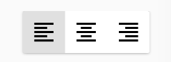
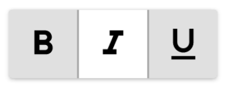
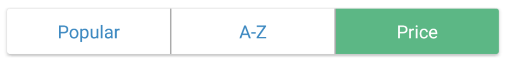

# ToggleButtonLayout

Easy creation and management of toggle buttons from the Material Design [spec](https://material.io/guidelines/components/buttons.html#buttons-toggle-buttons)





# Dependency
```gradle
compile 'com.savvyapps:togglebuttonlayout:latest.release.here'
```

# Usage
Add the ToggleButtonLayout to your layout:
```xml
<com.savvyapps.togglebuttonlayout.ToggleButtonLayout
    android:id="@+id/toggle_button_layout"
    android:layout_width="wrap_content"
    android:layout_height="wrap_content"
    android:layout_gravity="center_horizontal"
    android:layout_marginBottom="16dp"
    app:menu="@menu/toggles" />
```
where the toggles menu looks like:
```xml
<?xml version="1.0" encoding="utf-8"?>
<menu xmlns:android="http://schemas.android.com/apk/res/android">

    <item
        android:id="@+id/toggle_left"
        android:icon="@drawable/ic_format_align_left_black_24dp" />

    <item
        android:id="@+id/toggle_center"
        android:icon="@drawable/ic_format_align_center_black_24dp" />

    <item
        android:id="@+id/toggle_right"
        android:icon="@drawable/ic_format_align_right_black_24dp" />
</menu>
```
You can safely ignore lint warnings about needing a title on each item, unless you want a title to appear on each item.

Later, you can get the selected items via:
```kotlin
val selectedToggles = toggleButtonLayout.getSelectedToggles()
//do what you need to with these selected toggles
```

# Customization
You can customize the `ToggleButtonLayout` via XML attributes:
```xml
<com.savvyapps.togglebuttonlayout.ToggleButtonLayout
    android:id="@+id/toggle_text"
    android:layout_width="match_parent"
    android:layout_height="wrap_content"
    android:layout_gravity="center_horizontal"
    android:layout_margin="16dp"
    app:allowDeselection="false"
    app:customLayout="@layout/view_toggle_button"
    app:dividerColor="@android:color/darker_gray"
    app:selectedColor="?attr/colorAccent"
    app:menu="@menu/toggles"
    app:multipleSelection="true"
    app:toggleMode="even" />
```

If you use the `customLayout` attribute, the layout is expected to have a `TextView` with an ID of `android:id="@android:id/text1"` if you are using a title, and if you are using an icon, `android:id="@android:id/icon"`. You can omit either of these if you are only using a menu resource with a title or just an icon. See the sample for more.
